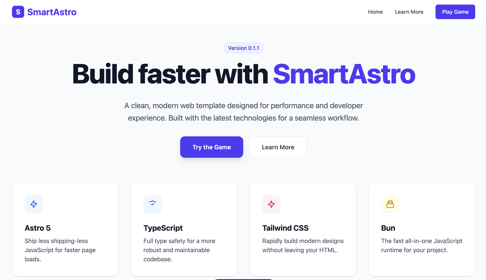

# SmartAstro

[](https://app.codacy.com/gh/guildenstern70/smart-astro/dashboard?utm_source=gh&utm_medium=referral&utm_content=&utm_campaign=Badge_grade)



*SmartAstro* is a template for building lightweight and modern websites. It is based on the Astro framework and uses the following technologies:

* TypeScript
* React
* Bun
* Milligram CSS (https://milligram.io/)

SmartAstro templates can be deployed on Netlify. 
You can view the demo site at [https://smartastro.netlify.app](https://smartastro.netlify.app).

It is designed to be easy to use and customize, allowing you to create a beautiful and functional website quickly.


## Setup

Install dependencies:

```bash
bun install
```

## Development

Run the development server:

```bash
bun dev
```

## Build

Build the project for production:

```bash
bun build
```

Building the project will produce a set of static files in the "dist" directory, ready to be deployed 
on any HTTP server. The default configuration uses Netlify as host.

## Test

Run the tests:

```bash
bun test
```

## Docker

Build the container with

    docker build -t smart-astro .

Then run the container with

    docker run -p 8080:80 smart-astro 

You can now see the SmartAstro app in your browser at:

    http://localhost:8080


## License

This project is licensed under the BSD License. See the [LICENSE](LICENSE) file for details.
