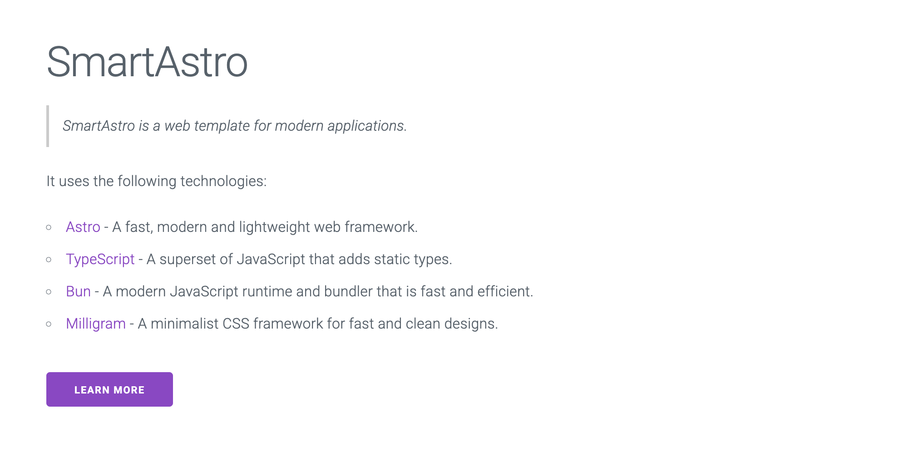

# SmartAstro

*SmartAstro* is a template for building lightweight and modern websites. It is based on the Astro framework and uses the following technologies:

* TypeScript
* React
* Bun
* Milligram CSS (https://milligram.io/)

SmartAstro templates can be deployed on Netlify. 
You can view the demo site at [https://smartastro.netlify.app](https://smartastro.netlify.app).

It is designed to be easy to use and customize, allowing you to create a beautiful and functional website quickly.



## Setup

Install dependencies:

```bash
bun install
```

## Development

Run the development server:

```bash
bun dev
```

## Build

Build the project for production:

```bash
bun build
```

## License

This project is licensed under the BSD License. See the [LICENSE](LICENSE) file for details.
